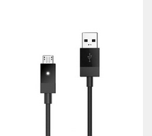

# Qualcomm® QRB2210 Open Kits LaneDetection-demo Developer documentation

## Introduce

The project is based on the QRB2210 development kit system source code and runs on the QRB2210 development board, making full use of the diverse and powerful connectivity and computing power of the development kit. Use OpenCV to load mp4 video files, process the video files frame by frame, identify the road lines in each frame of the picture and respond to it, and output the processed video frames as video stream files.

It is hoped that by detecting the current driving road traffic line, identifying the road traffic line, processing the road traffic line in the video frame, drawing the current driving road traffic line in real time, and blocking other interference information in the video frame, the processing result can be applied to the traffic scene to accurately output the current vehicle driving route.

Qualcomm® QRB2210 SoC Open Kits


## Materials and Tools used for the project

1. Hardware materials

Except for the Open Kits,The following hardware materials are also needed:

* Type-C usb line

using the usb line to develop on Qualcomm® QRB2210 SoC Open Kits.



* Charger

Direct power supply for Qualcomm® QRB2210 SoC Open Kits.


## Environment configuration

This section mainly describes the source and configuration of some open source projects or third-party tools needed in the development process.

### Opencv
OpenCV is a cross-platform computer vision and machine learning software library distributed under the Apache2.0 license (open source).  
url: https://opencv.org/

## Compile
No special compilation method is required. After configuring the RB1 special SDK, the product can be generated directly by Cmake compilation.

## Configure and Usage
Start the RB1 and connection RB1 to host by Type-c usb.
### 1. Configure
(1) After configuring the RB1 dedicated SDK, create a cross-compilation environment;  
(2) In the cross-compilation environment, directly generate products through Cmake compilation.

### 2. Usage
The executable files in the bin directory require an additional command line parameter.  
The parameter is the video file that needs to be processed.

```
adb push ./original_video.mp4 /data
adb push ./lane_detection /data
adb shell
cd data
./lane_detection original_video.mp4
...

exit
adb pull /data/LaneDetection_output.avi
```
Please use the video playback tool or ffplay to play the current video file and view the current lane detection results.

**result show**</br>

[original_video.mp4](./res/original_video.mp4)&nbsp;&nbsp;&nbsp;&nbsp;&nbsp;&nbsp;[result_video.avi](./res/result_video.avi)

<div style="display:flex;justify-content:space-between;;margin-top:20px;">
  
  
</div>